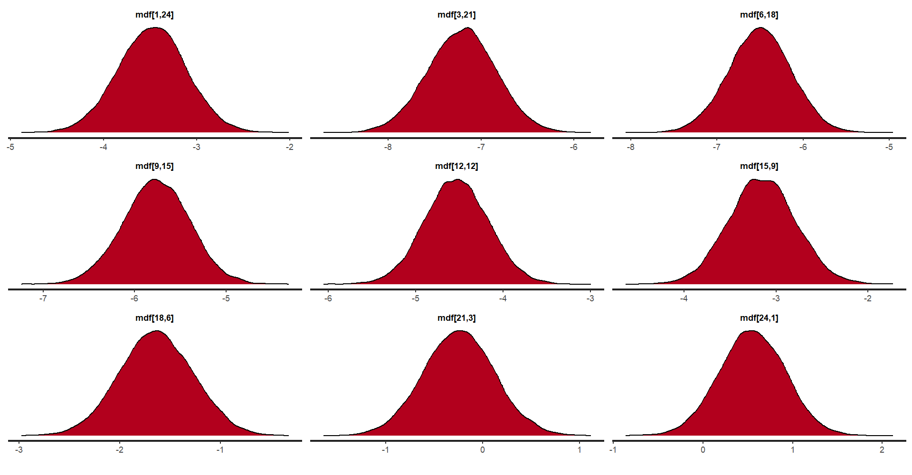
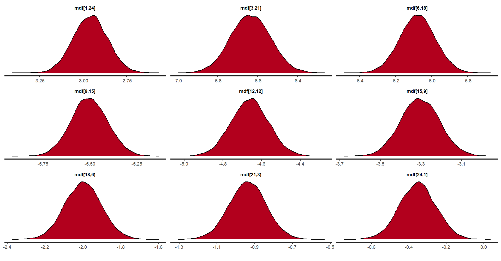

\pagenumbering{arabic}


```{r setup, include=FALSE}
knitr::opts_chunk$set(echo = FALSE, fig.align='center')

library(tidyverse)
library(HMDHFDplus)
library(viridis)
library(rstan)
library(knitr)
library(kableExtra)
library(tinytex)

source('load_tab.R')
```


```{=latex}
\setcounter{tocdepth}{3}
\tableofcontents
```

\newpage 

# Overview 

This essay evaluates and compares the effectiveness of the log-linear (LN) and Lee-Carter (LC) models in forecasting mortality trends in Canada. Using 1921 to 2012 as training data and 2013 to 2022 as a test period, the analysis highlights the strengths and limitations of each model in capturing patterns and predicting future mortality rates.


```{r overview_f, out.width="100%", fig.cap="Female mortality over the years across age groups."}

knitr::include_graphics("Graphs/Overview_Female.png") # mort_over_f

```

Figure 1 displays a typical mortality pattern, where modern times consistently show lower mortality rates in logarithmic terms. Newborn mortality, as expected, is higher than that of children over one year old. The mortality rate for 1-4-year-olds shows a downward trend until around age 10, after which it gradually increases with age. The slope from 0 to 1 year old is steeper in modern times. The narrower band near the beginning and end suggests that improvements in mortality have been most prominent in middle childhood. In older age groups, mortality rates are similar and almost overlap, indicating little significant improvement in mortality at advanced ages.

\newpage

```{r overview_m, out.width="100%", fig.cap="Male mortality over the years across age groups."}

knitr::include_graphics("Graphs/Overview_Male.png") # mort_over_m

```

In males, the rate of increase with age is slightly more pronounced compared to females, particularly in younger and middle adulthood (15-30 years). The band is also somewhat narrower overall, suggesting that males experience a more consistent decline in mortality rates across this age range, or that improvements in mortality have been more concentrated. 

Over time, mortality rates for both sexes have significantly decreased, indicating a steady improvement in life expectancy. The highest mortality rates still occur in older age groups. Notably, female mortality rates remain slightly lower than those of males across the entire age range, reflecting a persistent gender gap in survival.

\newpage 

# Forecast

Both the LN and LC models are used to forecast mortality rates and life expectancy. 1921 to 2012 is used as training data, and 2013-2022 as test. 2011-13 is roughly when the first wave of babyboomer retires. 75% would be until ~1998, ok for long term, but may not capture recent shifts, so decided 2013.

## Mortality Rates
```{r mort_f, out.width="100%", fig.cap="Forecasted female mortality rates of LN and LC models compared to observed values.", results = 'asis'}

knitr::include_graphics("Graphs/forecast_mort_f.png")

```


In the forecasts for female mortality, both the LN and LC models predict a clear trend of decreasing mortality rates over time, aligning with the observed data. For younger age groups, both models capture the significant decline in mortality, especially in infancy and childhood, with slight differences in the magnitude of the predicted decline. However, in middle and older age groups, the predictions from both models tend to converge, and both models struggle to capture finer details of mortality improvements. In particular, the LN model shows a stronger trend toward lower mortality for younger adults compared to the LC model, which may reflect the LN model's simpler approach and its less nuanced treatment of age-specific mortality. Overall, both models predict a general decline in mortality, but the LC model appears more sensitive to recent shifts in mortality trends, especially for older age groups.

\newpage

```{r mort_m, out.width="100%", fig.cap="Forecasted male mortality rates of LN and LC models compared to observed values.", results = 'asis'}

knitr::include_graphics("Graphs/forecast_mort_m.png")

```


For male mortality, the forecasts also show a general decline over time, but with a more pronounced drop at younger adult ages compared to females, which is consistent with the observed data. Both the LN and LC models predict a continued increase in mortality as age advances, with the highest mortality rates occurring in older adults. The LN model provides a smoother forecast across age groups, while the LC model better captures fluctuations in mortality, especially at later ages. However, like the female data, the LC model's forecasts are less consistent for males in certain age ranges, particularly for those aged 15-30, where the LN model offers more accurate and reliable predictions. In summary, while both models predict a reduction in male mortality, the LC model's performance is slightly less reliable in the younger age groups, suggesting it may not fully capture certain health trends in this population.

\newpage

## Life Expectancy

```{r le_f, out.width="100%", fig.cap="Forecasted female life expectancy of LN and LC models compared to observed values"}

knitr::include_graphics("Graphs/forecast_le_m.png")

```

In the life expectancy forecasts for females, both the LN and LC models predict a steady increase in life expectancy over time, reflecting overall improvements in mortality rates. The forecasts align closely with the observed data, with both models capturing the general upward trend in life expectancy. However, the LN model appears to have a more nuanced prediction, particularly in the later years, suggesting it is more sensitive to recent mortality improvements. The LC model, while still capturing the general trend, appears to smooth out some of the finer variations observed in the data.

\newpage

```{r le_m, out.width="100%", fig.cap="Forecasted male life expectancy of LN and LC models compared to observed values"}

knitr::include_graphics("Graphs/forecast_le_m.png")

```


For males, the life expectancy forecasts show a similar upward trajectory. Both models predict a significant improvement in life expectancy, but the LN model appears to slightly underestimate this increase, particularly for the earliest and most recent years. The LC model consistently overestimates life expectancy. 


While both models provide reasonable forecasts for both sexes, the LN model better captures the dynamics of mortality improvements in recent years, making it a more accurate tool for forecasting male life expectancy over time.

\newpage

## Quality of Estimates

### Log-Linear Model

The LN model initially encountered a few issues related to Bayesian convergence and effective sampling, which are critical for obtaining reliable posterior estimates. Specifically, the Bayesian Fraction of Missing Information (BFMI) was low, suggesting that the model had not explored the parameter space effectively during sampling. This often indicates difficulties in convergence or that the sampling procedure is inefficient. A low BFMI can lead to biased posterior distributions, meaning that the model might not have accurately captured the true relationships in the data. Additionally, the R-hat value for the LN model was high, reaching 1.06. In Bayesian inference, R-hat values close to 1 indicate that the chains have mixed well and converged to the same posterior distribution. An R-hat greater than 1.1 generally signals potential convergence problems. High R-hat values indicate that the chains may not have fully explored the parameter space, potentially leading to inaccurate inferences. Bulk Effective Sample Size (ESS) and Tail ESS were also too low, which suggests that the number of independent samples from the posterior distribution was insufficient. Low ESS values mean that the posterior estimates are not well-supported by the data, making the results less reliable.

These issues were addressed by increasing the adapt_delta parameter from 0.97 to 0.9999, which improves the accuracy of the sampling algorithm by reducing step sizes and thus allowing for better exploration of the parameter space. Additionally, the warmup period was extended to 2000 iterations, allowing the model to adapt more thoroughly before starting the sampling process. Furthermore, the number of iterations was increased from 1500 to 6000, and the number of chains was increased to four, which enhanced the mixing of the chains and ensured better convergence. These steps helped to reduce R-hat and improve the ESS values, leading to more reliable posterior estimates.

### Lee-Carter Model

The LC model faced an issue related to model convergence. R-hat values larger than 1.53 were observed. This suggests that the chains for certain parameters had not fully converged, and thus, their posterior distributions might not have been well-explored. Poor convergence can lead to unreliable parameter estimates, affecting the validity of the model's predictions. 

```{r lc_ben, out.width="80%", fig.cap="Trace graphs of unnormarlized changes of age profile."}

knitr::include_graphics("Graphs/lc_ben_f.png") # lc_trace_ben_f 
# knitr::include_graphics("Graphs/lc_ben_m.png") # lc_trace_ben_m

```


However, upon closer inspection, this does not pose to be a serious issue since it's only the the unnormalized changes in the age profile that is not converging, as seen in figure 7. 

\newpage

```{r lc_b, out.width="50%", fig.cap="R-hat values of normarlized changes of age profile."}
knitr::include_graphics("Graphs/lc_b_f.png")
# knitr::include_graphics("Graphs/lc_b_m.png")
```

The normalized changes in the age profile, which is what's actually used in the model, shows good convergence.

```{r mdf_trace, out.width="50%", fig.cap="Sample trace graphs of mortality rates."}

knitr::include_graphics("Graphs/lc_trace_mdf_f.png") # lc_trace_mdf_f
# knitr::include_graphics("Graphs/lc_trace_mdf_m.png") 

```

Mortality rates show good convergence. 

```{r lc_rhat, out.width="50%", fig.cap="R-hat values across all parameters."}

knitr::include_graphics("Graphs/lc_rhat_f.png")# lc_rhat_all_f
# knitr::include_graphics("Graphs/lc_rhat_m.png")

```

The r-hat values across all parameters are distributed near 1. 

\newpage

### Model Comparison

Since the distributions of the posterior (mortality rates) of each model are fairly symmetrical, the means are used for calculating model accuracy.

<!-- ```{r mdf_dens, out.width="45%", fig.cap="Select density graphs of female mortality rates for LN and LC models, respectively."} -->

<!--  # ln_dens_mdf_f -->
<!--  # lc_dens_mdf_f -->

<!-- ``` -->

<!-- Various errors are calculated. -->

```{r mean_err}

error
tab_rmse

```

The LC model has smaller Mean Error (ME), indicating more balanced forecasts, while the LN model shows a slight overestimation of mortality rates. The LC model demonstrates better precision with smaller Mean Absolute Error (MAE) and Root Mean Square Error (RMSE) values, indicating more consistent and reliable predictions compared to the LN model.

```{r error_perc}

error_perc

```

The LC model has smaller Mean Percentage Error (MPE) and Mean Absolute Percentage Error (MAPE) values, suggesting more accurate forecasts in relative terms, while the LN model underestimates mortality rates substantially.


Overall, the LC model consistently outperforms the LN model across all error metrics, especially in terms of accuracy and precision (MAE, RMSE, and MAPE). The LN model's larger mean and percentage errors suggest it struggles with both bias and variance in its forecasts, producing less reliable mortality predictions for both sexes. For both males and females, the LC model provides a more accurate and stable forecast, making it the more effective model for predicting mortality rates in the given period. The LN model's high MAPE and MAE suggest that it may not capture certain dynamics in the data as well as the LC model, particularly when considering relative forecast errors.


```{r acc_prop, tab.cap="Proportion of observed mortality rates in 2013-2022 that fall within the 95% credible interval."}

tab_prop

```

For both sexes, the LN model consistently outperforms the LC model in terms of the proportion of observed mortality rates within the predictive interval. Specifically, for females, 80.4% of the observed mortality rates fall within the predictive interval of the LN model, compared to 78.3% for the LC model. In the case of males, the difference is even more pronounced, with 71.7% of observed mortality rates falling within the predictive interval of the LN model, while the LC model only captures 55% of the observed data within its interval. This suggests that the LN model provides more accurate and reliable forecasts for both sexes, particularly for males.

The LC model shows less accuracy, particularly for males, where its predictive interval captures a significantly lower proportion of observed mortality rates. This discrepancy may be due to the inherent limitations of the LC model, which focuses on age-specific mortality trends and temporal changes in mortality rates but may not capture all variations in mortality behavior, especially in more recent periods where shifts in health trends may not align with the model's assumptions. In contrast, the LN model, which uses a simpler approach based on a log transformation of mortality rates, appears to be more robust across both sexes, offering better calibration for the observed data. This comparison highlights the potential for the LN model to be more reliable when forecasting mortality rates in the given context.


\newpage 

# Challenges

## Short-term

Short-term mortality data can be volatile due to factors such as seasonal diseases, natural disasters, and economic shifts. This volatility makes it challenging to distinguish between random fluctuations and underlying trends, leading to uncertainties in short-term mortality forecasts.

For instance, the 2016 wildfires in Fort McMurray, Alberta led to temporary but significant increases in deaths, particularly among vulnerable populations like the elderly or those with pre-existing health conditions. These events can skew mortality data in the short term, making it harder to distinguish between the impact of the disaster itself and the usual mortality patterns of the population. Similarly, the COVID-19 pandemic has introduced significant fluctuations in mortality rates, complicating short-term projections. The Office of the Chief Actuary (OCA) notes that while long-term mortality projections emphasize historical trends, recent events like the pandemic can disrupt these patterns, affecting both short-term and long-term forecasts. 

While Bayesian inference is well-suited to handling uncertainty and allows for the continuous update of predictions as new information becomes available, one challenge here is the specification of prior distributions. If historical mortality data includes periods of frequent natural disasters or other catastrophic events, the priors may need to be adjusted to account for these outliers. For instance, a prior distribution based on average mortality data might not fully capture the spike in mortality that occurs immediately after a natural disaster. Bayesian models must therefore incorporate this uncertainty about the potential impact of rare events. This can be done by specifying a heavy-tailed prior, such as a Student’s t-distribution, which allows for occasional large deviations from the typical mortality rates. 

Another difficulty in updating the model with Bayesian inference arises from distinguishing between these temporary fluctuations and long-term trends. For example, a large spike in mortality following a major natural disaster may require a complex model update, as the Bayesian process has to differentiate whether this change is due to a random fluctuation or represents a significant shift in underlying mortality patterns. Given the relatively short duration of such events, models must ensure that these spikes do not unduly influence long-term mortality forecasts, especially when forecasting using data like the linear log or Lee-Carter models that focus on long-term mortality trends.


## Long-term

The recent increase in immigration to Canada affects mortality forecasting in several ways, particularly in the short term and long term. In the short term, the influx of younger immigrants, who generally have lower mortality rates, can result in an overall reduction in the country's mortality rate. This shift is because younger individuals, particularly those arriving through skilled worker programs, typically have lower mortality risks compared to the broader population. As a result, forecasting models must adjust for the changing age distribution in the population, as the higher number of younger individuals dilutes the impact of mortality in older age groups.

However, the impact of immigration on mortality forecasting is not entirely straightforward. Immigrants from different regions may have distinct health profiles, with factors such as socio-economic status, access to healthcare, and lifestyle playing significant roles in their mortality rates. For instance, immigrants from Southeast Asia or the Middle East may experience better health outcomes initially due to the Healthy Immigrant Effect, but could see these outcomes converge with the Canadian average over time as they adapt to their new environment. These health transitions can further complicate long-term mortality predictions, as models must account for the dynamic nature of immigrant health profiles.

In Bayesian inference, this requires careful modeling of prior distributions that incorporate these cohort-specific effects. The prior must allow for shifts in mortality rates over time as immigrant cohorts adjust to Canadian lifestyles, access to healthcare, and socio-economic factors. This is particularly challenging in the Lee-Carter model, which decomposes mortality into age, time, and cohort effects. The model must account for the fact that mortality rates for immigrants may not follow the same patterns as the general population, leading to a misalignment in the expected trends for certain age groups. Incorporating this shifting trend requires careful specification of the priors and the use of hierarchical modeling, where different groups (e.g., native-born vs. immigrant populations) are modeled separately before being combined into a unified forecast.
