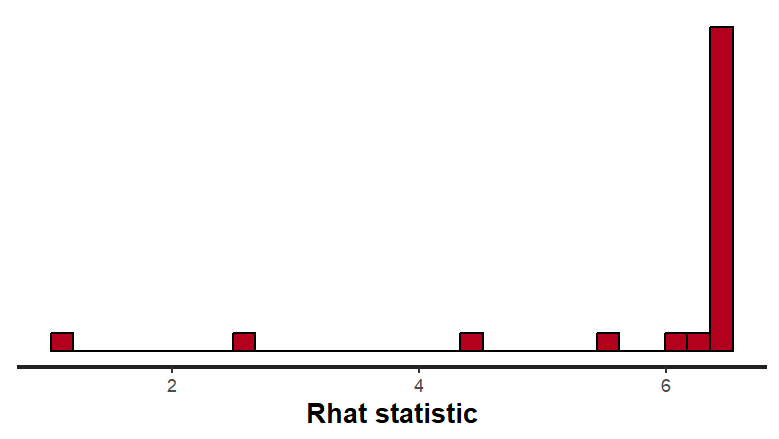
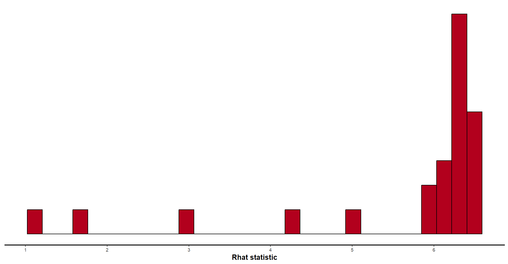
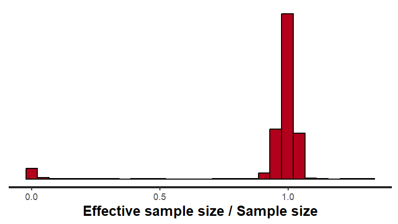
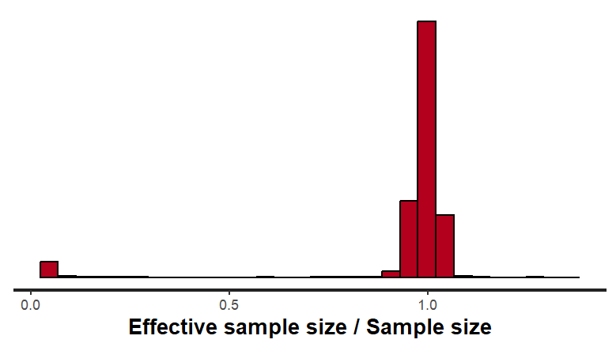
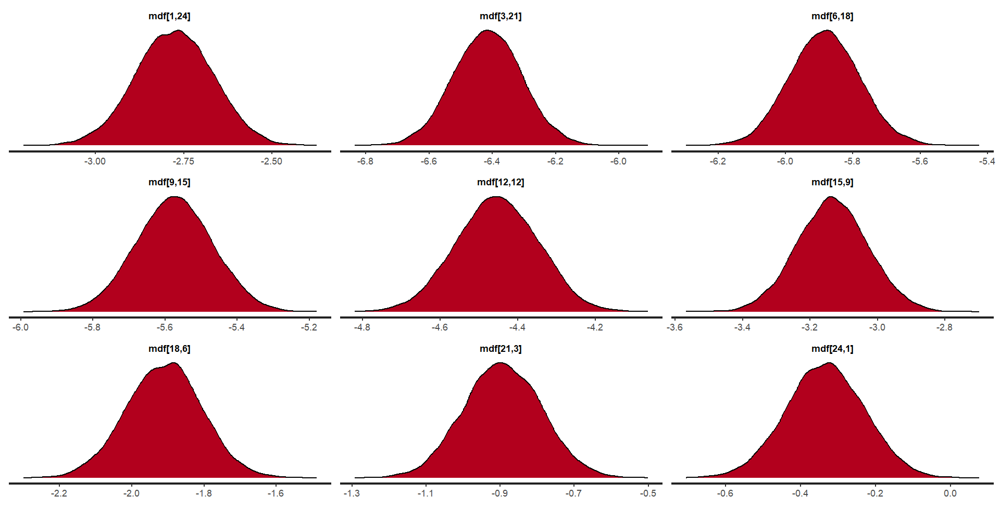

```{r setup, include=FALSE}
knitr::opts_chunk$set(echo = FALSE, fig.align='center')

library(tidyverse)
library(HMDHFDplus)
library(viridis)
library(rstan)
library(knitr)
library(kableExtra)
library(tinytex)

source('load_tab.R')
```


# Overview 

The graphs show mortality trends for males and females in Canada from 1921 to 2022, with mortality rates measured in log10 scale. For both sexes, mortality is highest in infancy and early childhood, as indicated by the steep dip at age 0 and then a gradual increase starting from early adulthood. In males, mortality consistently increases with age, with a noticeable uptick in middle adulthood, particularly post-50. The mortality rate for males also shows a marked upward trend after 60, peaking around 100 years old. For females, the trend follows a similar pattern, but the rate of increase with age is slightly less pronounced compared to males, especially in younger and middle adulthood.

```{r overview_f, out.width="100%"}

knitr::include_graphics("Graphs/Overview_Female.png") # mort_over_f

```

```{r overview_m, out.width="100%"}

knitr::include_graphics("Graphs/Overview_Male.png") # mort_over_m

```

Over time, mortality for both sexes has decreased significantly, particularly from the 1920s through to the early 2000s. The data shows a distinct shift from darker purple hues (indicating higher mortality) in earlier years to lighter yellow and orange hues (indicating lower mortality) in the later years, reflecting improvements in healthcare and living conditions. The trends suggest a steady improvement in life expectancy, with sharper declines in mortality observed after the mid-20th century, though the highest mortality rates still occur in the older age groups. Notably, female mortality rates remain slightly lower than those of males across the entire age range, suggesting a consistent gender gap in survival.

# Forecasts 

I'm using 1921 to 2012 as training data, and 2013-2022 as test. 2011-13 is roughly when the first wave of babyboomer retires. 75% would be until ~1998, ok for long term, but may not capture recent shifts, so decided 2013.

forecasts of all age groups compared to actual
```{r mort_f, out.width="100%"}

knitr::include_graphics("Graphs/forecast_mort_f.png")

```

```{r mort_m, out.width="100%"}

knitr::include_graphics("Graphs/forecast_mort_m.png")

```

- forecastts of life expectancy (age v year, median, lc and ln, 4 graphs total)

```{r le_f, out.width="100%"}

knitr::include_graphics("Graphs/forecast_le_m.png")

```

```{r le_m, out.width="100%"}

knitr::include_graphics("Graphs/forecast_le_m.png")

```

## Quality of Estimates

### Log-Linear Model

- iSSUE:  Bayesian Fraction of Missing Information was low, increase adapt_delta
FIXED BY INCREASING adapt_delta FROM 0.97 TO 0.9999 and warm up to 2000

- iSSUE:  The largest R-hat is 1.06, Bulk Effective Samples Size (ESS) AND tail Effective Samples Sizeis too low, indicating posterior means and medians may be unreliable.  
FIXED BY INCREASING ITER FROM 1500 TO 6000
increased chains to 4

for male all 4 chains have low BFMI but rhat is close to 1, so convergence is still good.
No divergence warnings.
SHOW GRAPH?????
- Trace plots should show stationary, non-trending behavior.
- Density plots are smooth and unimodal (unless there are multiple modes in the posterior).


### Lee-Carter Model
- forecast results

### Issues
for BOTH SEXES 
-issue: large r-hat(1.53), chains have not mixed (only ben?) 
No issues of convergence in other priors (average age profile, time effect, autoregression (random walk) parameter, or standard deviations)


Overall rhat ok
```{r lc_rhat, out.width="100%"}

knitr::include_graphics("Graphs/lc_rhat_f.png")# lc_rhat_all_f
# knitr::include_graphics("Graphs/lc_rhat_m.png")

```


Only ben has large rhat. 
```{r lc_rhat_ben, out.width="100%"}

# 
```

normalized version B is fine.
```{r lc_b, out.width="100%"}
knitr::include_graphics("Graphs/lc_b_f.png")
# knitr::include_graphics("Graphs/lc_b_m.png")
```


No convergence for ben but only ben.
```{r lc_ben, out.width="100%"}

knitr::include_graphics("Graphs/lc_ben_f.png") # lc_trace_ben_f 
# knitr::include_graphics("Graphs/lc_ben_m.png") # lc_trace_ben_m

```

Convergence of mdf ok 

```{r mdf_trace, out.width="100%", fig.cap="Sample trace graphs of mdf."}

knitr::include_graphics("Graphs/lc_trace_mdf_f.png") # lc_trace_mdf_f
# knitr::include_graphics("Graphs/lc_trace_mdf_m.png") 

```

-issue: bulk and tail ESS too low, indicating posterior means and medians may be unreliable.

```{r lc_ess, out.width="100%"}

 # lc_ess_f
#  # lc_ess_m

```


### Model Comparison

Using mean of mdf (posterior mort) since it's fiarly symmetrical/normal

```{r mdf_dens_ln, out.width="48%"}

knitr::include_graphics("Graphs/ln_dens_mdf_f.png") # ln_dens_mdf_f

```

```{r mdf_dens_lc, out.width="48%"}

knitr::include_graphics("Graphs/lc_dens_mdf_f.png") # lc_dens_mdf_f
#  # lc_dens_mdf_m

```


#### Errors

```{r mean_err}

error
tab_rmse

```

The LC model has smaller Mean Error (ME), indicating more balanced forecasts, while the LN model shows a slight overestimation of mortality rates.

The LC model demonstrates better precision with smaller Mean Absolute Error (MAE) and Root Mean Square Error (RMSE) values, indicating more consistent and reliable predictions compared to the LN model.

```{r error_perc}

error_perc

```

The LC model has smaller Mean Percentage Error (MPE) and Mean Absolute Percentage Error (MAPE) values, suggesting more accurate forecasts in relative terms, while the LN model underestimates mortality rates substantially.

Summary
The LC model consistently outperforms the LN model across all error metrics, especially in terms of accuracy and precision (MAE, RMSE, and MAPE).
The LN model's larger mean and percentage errors suggest it struggles with both bias and variance in its forecasts, producing less reliable mortality predictions for both sexes.
For both males and females, the LC model provides a more accurate and stable forecast, making it the more effective model for predicting mortality rates in the given period. The LN model's high MAPE and MAE suggest that it may not capture certain dynamics in the data as well as the LC model, particularly when considering relative forecast errors.


#### Accuracy 

using the 95% credible interval (columns 2.5% and 97.5% ), the proportion of observed mortality rates in 2013-2022 that fall within the predictive intervals of the forecasts are as follows

For both sexes, the Linear Log (LN) model consistently outperforms the Lee-Carter (LC) model in terms of the proportion of observed mortality rates within the predictive interval. Specifically, for females, 80.4% of the observed mortality rates fall within the predictive interval of the LN model, compared to 78.3% for the LC model. In the case of males, the difference is even more pronounced, with 71.7% of observed mortality rates falling within the predictive interval of the LN model, while the LC model only captures 55% of the observed data within its interval. This suggests that the LN model provides more accurate and reliable forecasts for both sexes, particularly for males.

The Lee-Carter (LC) model shows less accuracy, particularly for males, where its predictive interval captures a significantly lower proportion of observed mortality rates. This discrepancy may be due to the inherent limitations of the LC model, which focuses on age-specific mortality trends and temporal changes in mortality rates but may not capture all variations in mortality behavior, especially in more recent periods where shifts in health trends may not align with the model's assumptions. In contrast, the LN model, which uses a simpler approach based on a log transformation of mortality rates, appears to be more robust across both sexes, offering better calibration for the observed data. This comparison highlights the potential for the LN model to be more reliable when forecasting mortality rates in the given context.

```{r acc_prop}

tab_prop

```


# Challenges (40%)
## short-term (5y)
## long-term (30-50y)