\pagenumbering{arabic}
\newpage

```{r setup, include=FALSE}
knitr::opts_chunk$set(echo = FALSE, fig.align='center')

library(tidyverse)
library(HMDHFDplus)
library(viridis)
library(rstan)
library(knitr)
library(kableExtra)
library(tinytex)

source('load_tab.R')
```


```{=latex}
\setcounter{tocdepth}{3}
\tableofcontents
```

\newpage 

# Introduction

The effectiveness of mortality forecasting models plays a critical role in demographic analysis. Two widely used models for this purpose are the log-linear (LN) model and the Lee-Carter (LC) model. By applying these models to Canadian mortality data (HMD, 2025), their ability to capture mortality trends for females and males will be compared. Through an examination of model performance metrics, such as error rates and forecast accuracy, this analysis aims to identify the strengths and limitations of each model in projecting future mortality rates. 

```{r overview_f, out.width="100%", fig.cap="Female mortality over the years across age groups."}

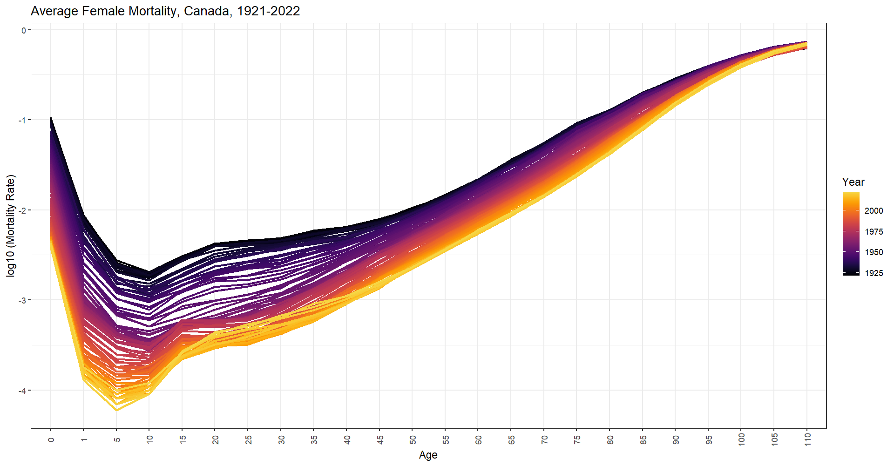 # mort_over_f

```

Figure 1 displays a typical mortality pattern, where modern times consistently show lower mortality rates in logarithmic terms. Newborn mortality, as expected, is higher than that of children over one-year old. The mortality rate for 1 to 4-year-olds shows a downward trend until around age 10, after which it gradually increases with age. The slope from 0 to 1 year old is steeper in modern times. The narrower band near the beginning and end suggests that improvements in mortality have been most prominent in middle childhood. In older age groups, mortality rates are similar and almost overlap, indicating little significant improvement in mortality at advanced ages.

\newpage

```{r overview_m, out.width="100%", fig.cap="Male mortality over the years across age groups."}

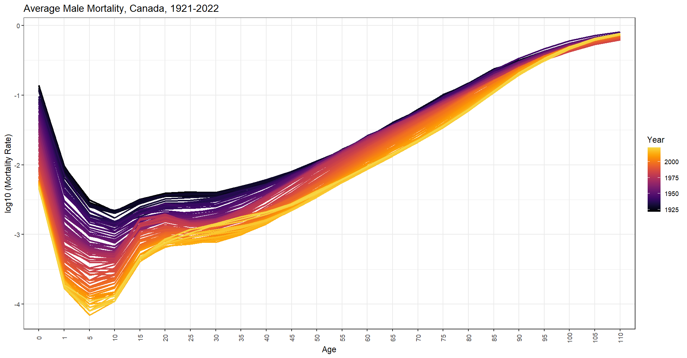 # mort_over_m

```

In males, the rate of increase with age is slightly more pronounced compared to females, particularly in younger and middle adulthood (15-30 years). The band is also somewhat narrower overall, suggesting that males experience a more consistent decline in mortality rates across this age range, or that improvements in mortality have been more concentrated. 

Over time, mortality rates for both sexes have significantly decreased, indicating a steady improvement in life expectancy. The highest mortality rates still occur in older age groups. Notably, female mortality rates remain slightly lower than those of males across the entire age range, reflecting a persistent gender gap in survival.

\newpage 

# Forecast

Both the LN and LC models are applied to forecast mortality rates and life expectancy, with data from 1921 to 2012 serving as the training set and 2013-2022 as the test period. The years 2011-2013 mark the approximate retirement of the first wave of baby boomers, and while data up to around 1998 captures long-term trends effectively for model training purposes, it may not fully account for recent shifts. Therefore, the decision was made to use 2013 as the starting point for testing.

## Mortality Rates

```{r mort_f, out.width="100%", fig.cap="Forecasted female mortality rates of LN and LC models compared to observed values.", results = 'asis'}

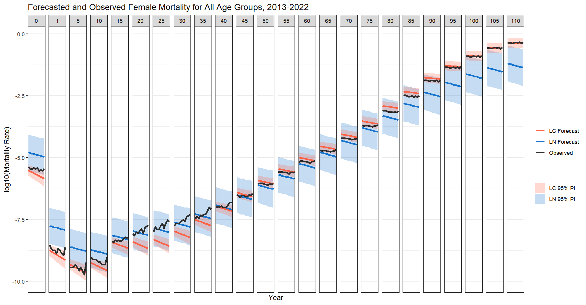

```

In the forecasts for female mortality, both the LN and LC models predict a clear trend of decreasing mortality rates over time, consistent with the observed data. For younger age groups, both models capture the significant decline in mortality, but fail to reflect the recent upward tick. In the 15-40 age range, neither model captures the upward trend seen in the observed data. Both models struggle to account for finer details in mortality improvements and fluctuations. However, the LC model is more sensitive to shifts in the data, aligning more closely with the observed trends, particularly for older age groups.

\newpage

```{r mort_m, out.width="100%", fig.cap="Forecasted male mortality rates of LN and LC models compared to observed values.", results = 'asis'}

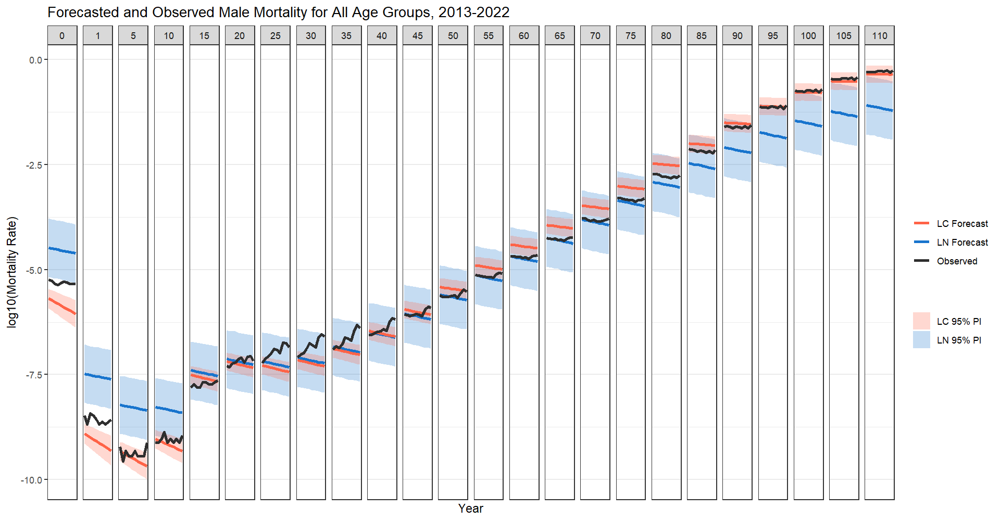

```

For male mortality, the forecasts show a general decline over time, but the provide more similar forecast values for ages 15 and 35 compared to the female forecasts. The LC model generally provides more accurate forecasts across age groups, particularly for older ages. Similar to the female data, the LC model’s forecasts for males are less consistent in certain age ranges, especially for those aged 15-30.

Neither model performs particularly well in predicting the test period (2013 and onward) when considering all age groups. Overall, both models struggle to capture the nuances in the test data, suggesting that improvements may be needed for more accurate predictions.

\newpage

## Life Expectancy

```{r le_f, out.width="100%", fig.cap="Forecasted female life expectancy of LN and LC models compared to observed values"}

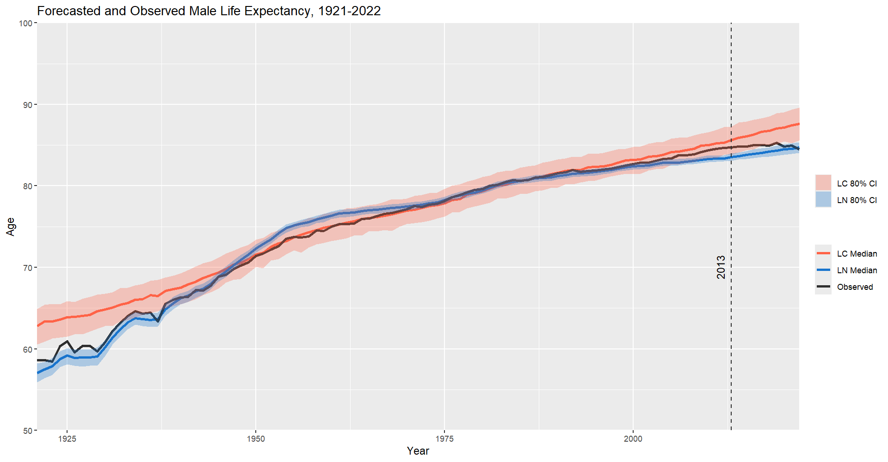

```

In the life expectancy forecasts for females, both the LN and LC models predict a steady increase over time, reflecting overall improvements in mortality rates. The forecasts align closely with the observed data, with both models capturing the general upward trend in life expectancy. However, the LN model appears to offer a more nuanced prediction, particularly in the early years, suggesting it is more sensitive to mortality changes. This increased sensitivity may, however, come at the cost of overfitting, as the model seems to react too strongly to short-term fluctuations in the data, potentially misrepresenting broader trends. In contrast, while the LC model captures the general trend, it appears to smooth out some of the finer variations observed in the data.


\newpage

```{r le_m, out.width="100%", fig.cap="Forecasted male life expectancy of LN and LC models compared to observed values"}


```

For males, the life expectancy forecasts show a similar upward trajectory, with both models predicting a significant improvement over time. However, the LN model slightly underestimates life expectancy in the early and later years, while overestimating it between 1940 and 1960. In contrast, the LC model consistently overestimates life expectancy across the entire period, indicating a potential bias toward more optimistic forecasts.

Forecast values for the test data (2013 and onward) show that the LN model is closer to the observed data, but it still fails to capture the recent downward tick in life expectancy, similar to the LC model. Overall, both models demonstrate limitations in accurately predicting recent trends, indicating the need for model adjustments or alternative approaches.

\newpage

## Modelling Issues

### Log-Linear Model

The LN model faced issues with Bayesian convergence and sampling efficiency, as indicated by a low Bayesian Fraction of Missing Information (BFMI), suggesting ineffective exploration of the parameter space. This can lead to biased posterior distributions. Additionally, the R-hat value was high (1.06), signaling potential convergence problems, and both the Bulk Effective Sample Size (ESS) and Tail ESS were too low, indicating insufficient independent samples and making the posterior estimates less reliable.

These issues were addressed by increasing the target average proposal acceptance probability (adapt_delta) from 0.97 to 0.9999, improving sampling accuracy by reducing step sizes for better exploration of the parameter space. The warmup period was extended to 2000 iterations, allowing the model to adapt more thoroughly by refining parameter estimates before sampling begins. Additionally, increasing the number of iterations from 1500 to 6000 and the number of chains to four enhanced convergence by providing multiple independent starting points. These adjustments helped increase BFMI, reduce R-hat, and improve ESS values, resulting in more reliable posterior estimates.

### Lee-Carter Model

The LC model encountered convergence issues, with R-hat values exceeding 1.53, indicating that the chains for certain parameters had not fully converged. As a result, the posterior distributions for these parameters may not have been adequately explored, potentially leading to unreliable estimates and compromising the validity of the model's predictions.

```{r lc_ben, out.width="80%", fig.cap="Trace graphs of unnormarlized changes of age profile."}

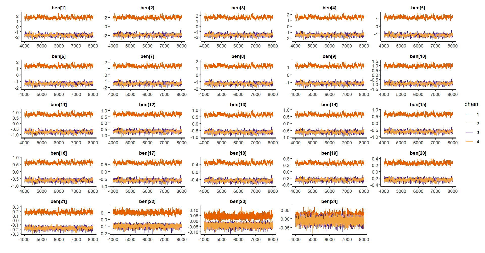 # lc_trace_ben_f 
# 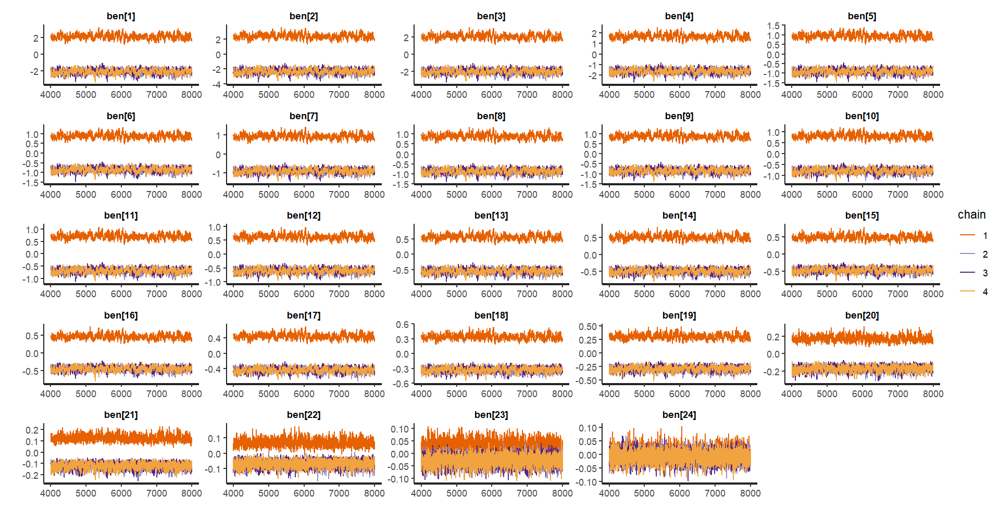 # lc_trace_ben_m

```

However, upon closer inspection, it becomes clear that this does not present a significant issue, as it is only the unnormalized changes in the age profile that are failing to converge, as shown in Figure 7.

\newpage

```{r lc_b, out.width="50%", fig.cap="R-hat values of normarlized changes of age profile."}
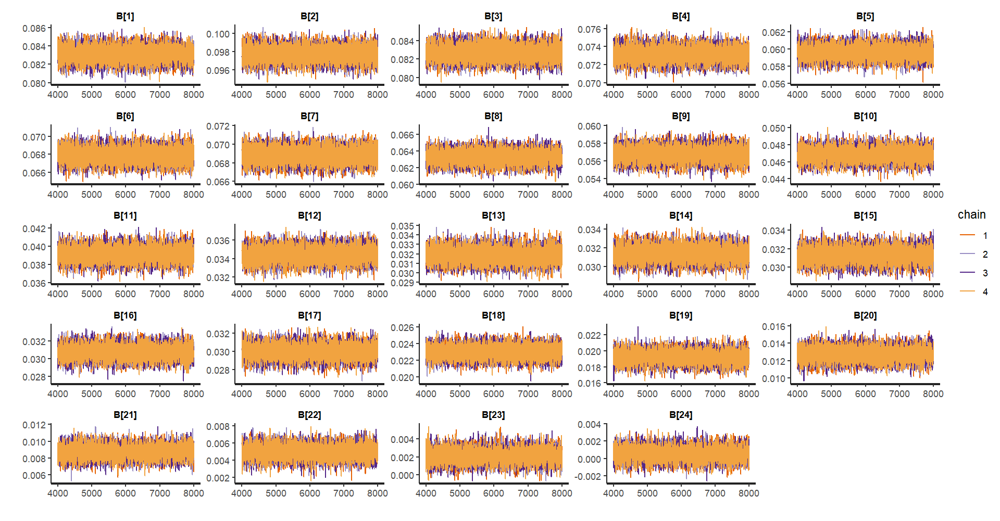
# 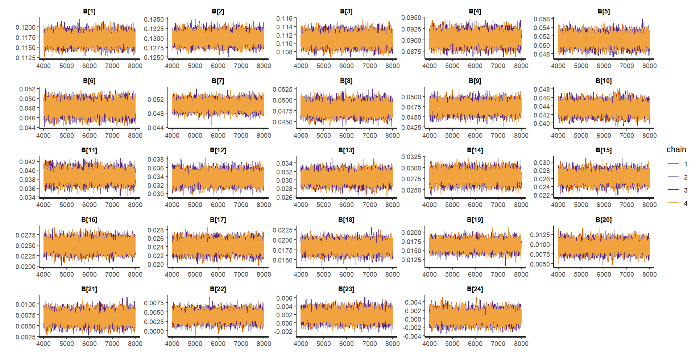
```

The normalized changes in the age profile, which are utilized in the model instead of the unnormalized counterpart, demonstrate good convergence.

```{r mdf_trace, out.width="50%", fig.cap="Sample trace graphs of mortality rates."}

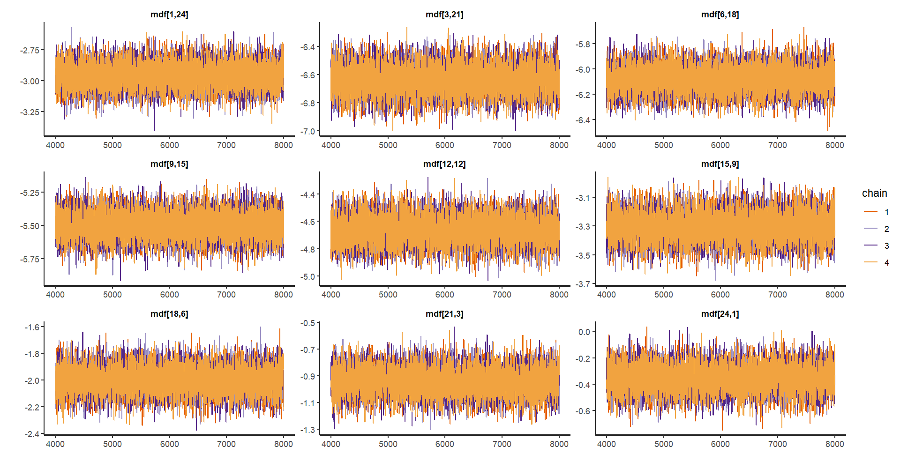 # lc_trace_mdf_f
# 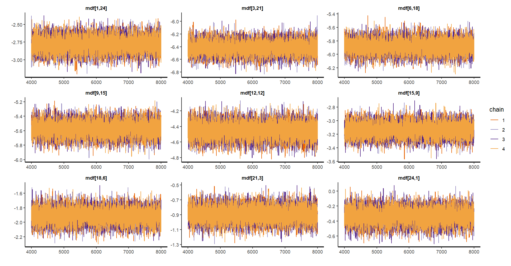 

```

The posterior for mortality rates also demonstrates good convergence, as shown in Figure 9.

```{r lc_rhat, out.width="50%", fig.cap="R-hat values across all parameters."}

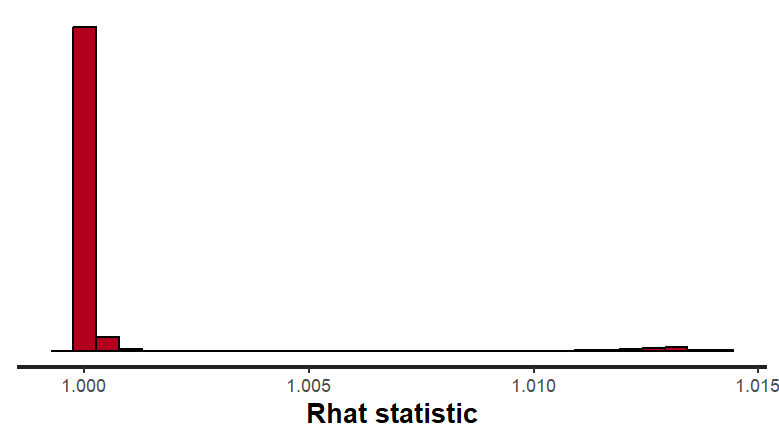# lc_rhat_all_f
# 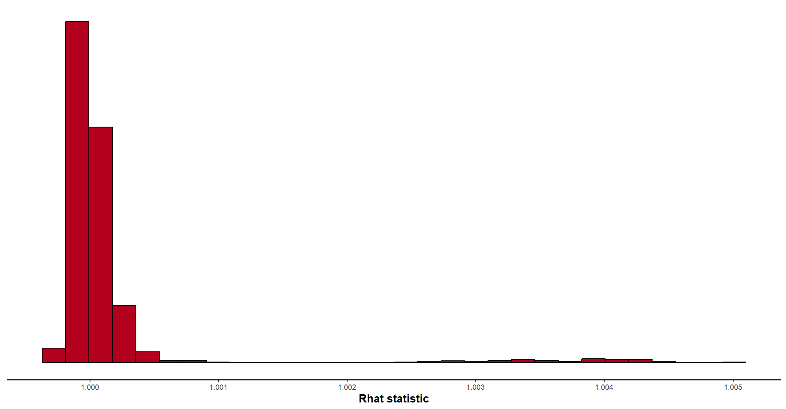

```

The R-hat values for all other parameters are close to 1, indicating that the chains have converged and mixed effectively and have explored the parameter space adequately.

\newpage

## Model Evaluation

Since the posterior distributions of mortality rates for each model are approximately symmetrical and unimodal, the means are utilized for calculating errors and model accuracy.

```{r mean_err}

error
error_rmse

```

The LC model has a smaller mean error (ME), indicating more balanced forecasts, while the LN model shows a slight overestimation of mortality rates. The LC model demonstrates better precision with smaller mean absolute error (MAE) and root mean square error (RMSE) values, indicating more consistent and reliable predictions compared to the LN model.

```{r error_perc}

error_perc

```

The LC model has smaller mean percentage error (MPE) and mean absolute percentage error (MAPE), suggesting more accurate forecasts in relative terms, while the LN model underestimates mortality rates substantially.


Overall, the LC model consistently outperforms the LN model across all error metrics, especially in terms of accuracy and precision (MAE, RMSE, and MAPE). The LN model's larger mean and percentage errors suggest it struggles with both bias and variance in its forecasts, producing less reliable mortality predictions for both sexes. For both males and females, the LC model provides a more accurate and stable forecast, making it the more effective model for predicting mortality rates in the given period. The LN model's high MAPE and MAE suggest that it may not capture certain dynamics in the data as well as the LC model, particularly when considering relative forecast errors.


```{r acc_prop, tab.cap="Proportion of observed mortality rates in 2013-2022 that fall within the 95% credible interval."}

tab_prop

```

However, when it comes to accuracy within the 95% predictive interval, the LN model consistently outperforms the LC model for both sexes. In males particularly, the difference is more pronounced, with 71.7% of accuracy for the LN model, while the LC model only captures 55% of the observed data within its interval.

The LN model's higher mean error and mean absolute error suggest that, on average, its predictions are further from the observed values compared to the LC model. However, its higher accuracy within the predictive interval indicates that, despite larger errors in individual predictions, the model is better at capturing the overall range or distribution of possible outcomes. This could imply that the model's predictions are more robust within the expected range, even if it struggles with outliers or extreme values. In conclusion, the LN model may be less precise on average but does a better job of predicting mortality within the expected bounds of variation.

\newpage 

# Challenges

## Disasters

Short-term mortality data can be volatile due to factors such as seasonal diseases, natural disasters, and economic shifts. This volatility makes it challenging to distinguish between random fluctuations and underlying trends. For instance, the 2016 wildfires in Fort McMurray, Alberta led to temporary but significant increases in deaths, particularly among vulnerable populations like the elderly or those with pre-existing health conditions. These events can skew mortality data, making it harder to distinguish between the impact of the disaster itself and the usual mortality patterns of the population. Similarly, the COVID-19 pandemic has had a direct impact on life expectancy in Canada, particularly in 2020, leading to significant reductions in expected lifespans and influencing both short-term and long-term mortality forecasts (Dion, 2021). This is evident in the performance of both models in this essay, which fail to capture the downward shift in life expectancy or the sudden upward trend in mortality observed in recent years. The inability of these models to incorporate the effects of such a large, unforeseen event highlights a key limitation in their forecasting ability, especially when faced with sudden disruptions to mortality patterns.

While Bayesian inference is well-suited to handling uncertainty and allows for the continuous update of predictions as new information becomes available, one challenge here is the specification of prior distributions. If historical mortality data includes periods of frequent natural disasters or other catastrophic events, the priors may need to be adjusted to account for these outliers. For instance, a prior distribution based on average mortality data might not fully capture the spike in mortality that occurs immediately after a natural disaster. Heavy-tailed priors can be selected to address this issue, as they improve robustness and maintain flexibility for rare events, but they also increase model complexity and computation time, with a risk of overfitting.

## Immigration

The recent increase in immigration (Statistics Canada, 2024) to Canada affects mortality forecasting in several ways. In the short term, the influx of younger immigrants, who generally have lower mortality rates, can result in an overall reduction in the country's mortality rate. This shift is because younger individuals, particularly those arriving through skilled worker programs, typically have lower mortality risks compared to the broader population. As a result, forecasting models must adjust for the changing age distribution in the population, as the higher number of younger individuals dilutes the impact of mortality in older age groups.

However, the impact of immigration on mortality forecasting is not entirely straightforward. Immigrants from different regions may have distinct health profiles, with factors such as socio-economic status, access to healthcare, and lifestyle playing significant roles in their mortality rates. They may experience better health outcomes initially due to the Healthy Immigrant Effect (Kennedy et al., 2014), but could see these outcomes converge with the Canadian average over time as they adapt to their new environment. These health transitions can further complicate long-term mortality predictions, as models must account for the dynamic nature of immigrant health profiles.

Again, this requires careful modeling of prior distributions that incorporate these cohort-specific effects. The prior must allow for shifts in mortality rates over time as immigrant cohorts adjust to Canadian lifestyles, access to healthcare, and socio-economic factors. This means mortality rates for immigrants may not follow the same patterns as the general population, leading to a misalignment in the expected trends for certain age groups. One possible solution may be initially modelling different groups (e.g., native-born vs. immigrant populations) separately before being combined into a unified forecast.

In conclusion, Bayesian mortality forecasting offers a powerful framework for predicting long-term trends, but it faces significant challenges when incorporating factors like natural disasters and immigration trends. Addressing these challenges through careful prior selection, model regularization, and efficient computational methods is essential to improving the accuracy and reliability in the Canadian context.

\newpage

# References

HMD. Human Mortality Database. Max Planck Institute for Demographic Research (Germany), University of California, Berkeley (USA), and French Institute for Demographic Studies (France). Available at www.mortality.org (Accessed: Feb 11 2025). 

Dion, P. (2021). Reductions in Life expectancy directly associated with COVID-19 in 2020, Demographic documents Statistics Canada. Available at: https://www150.statcan.gc.ca/n1/pub/91f0015m/91f0015m2021002-eng.htm (Accessed: Feb 11 2025).

Statistics Canada. (2024). Table 17-10-0014-01 Estimates of the components of international migration, by age and gender, annual [Data table]. https://doi.org/10.25318/1710001401-eng

Kennedy, S., Kidd, M. P., McDonald, J. T., & Biddle, N. (2014). The Healthy Immigrant Effect: Patterns and evidence from four countries. Journal of International Migration and Integration, 16(2), 317–332. doi:10.1007/s12134-014-0340-x.

